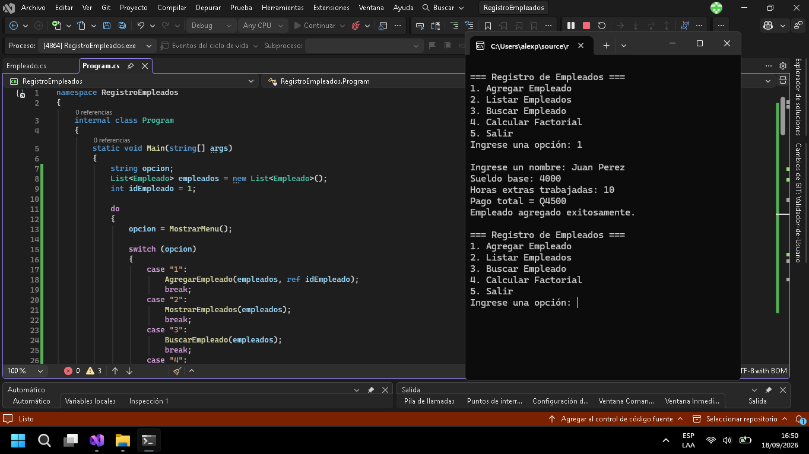
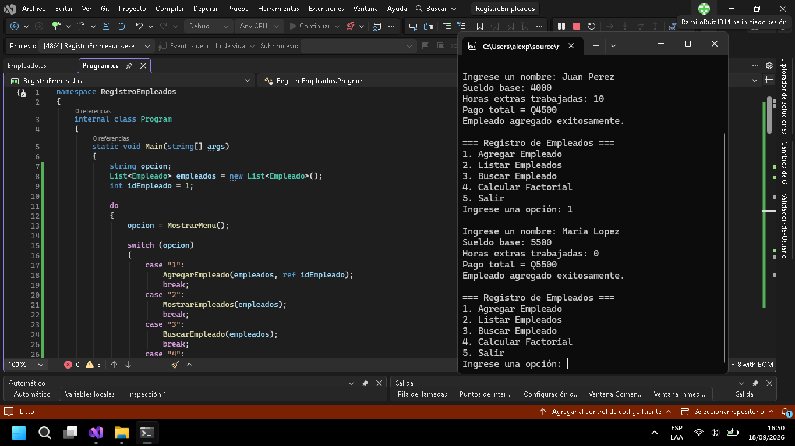
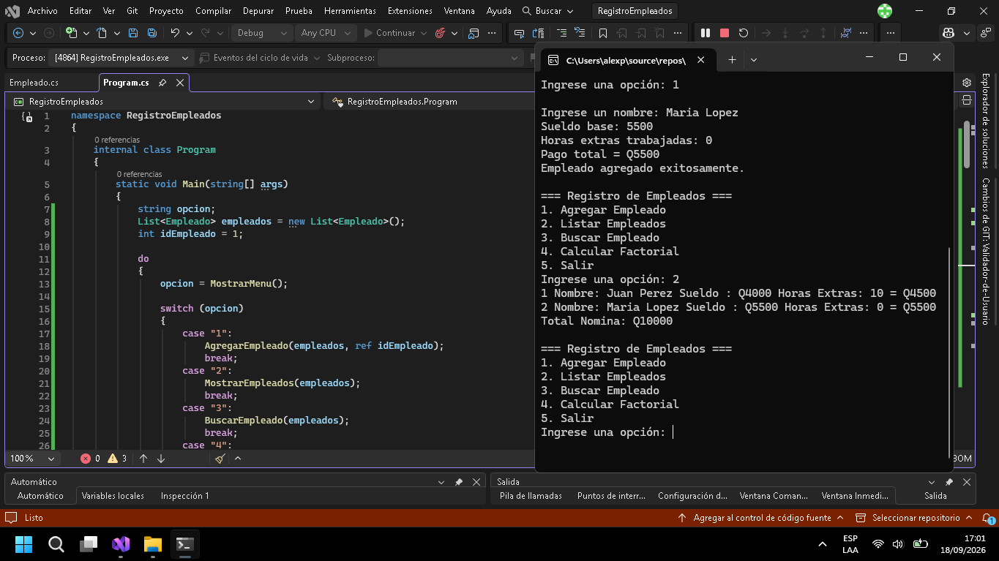
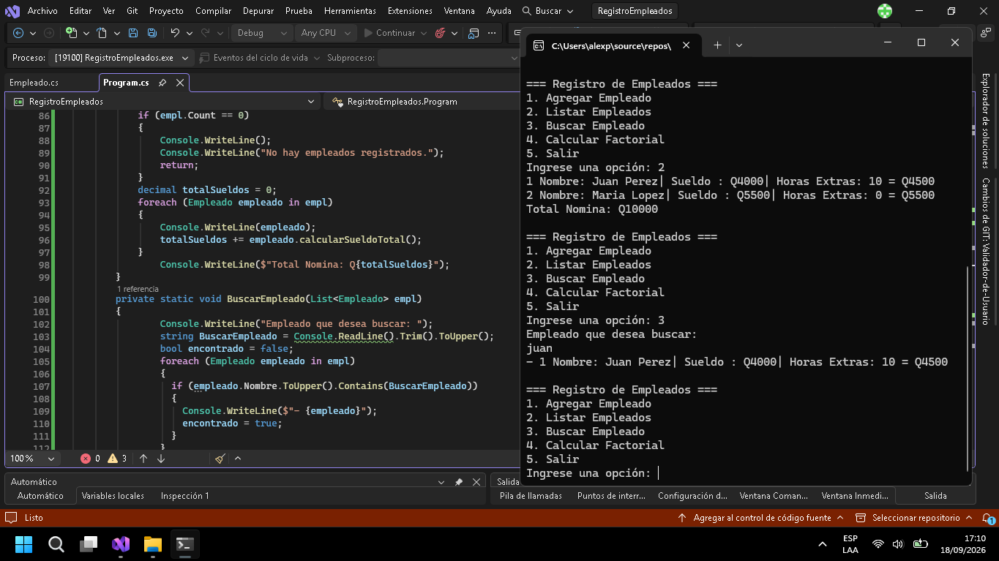
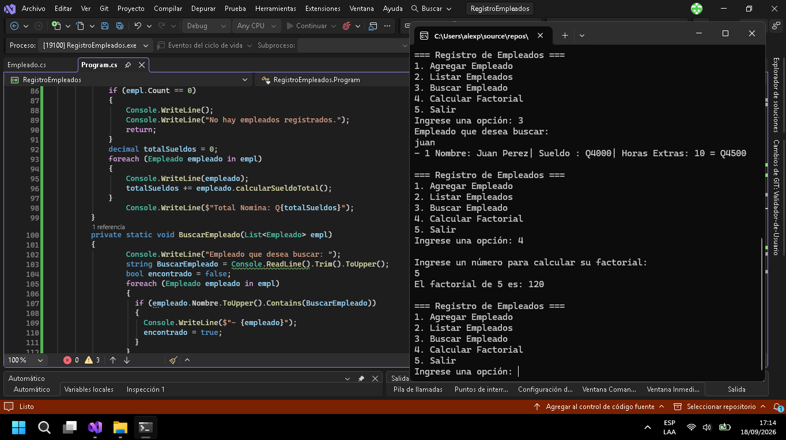
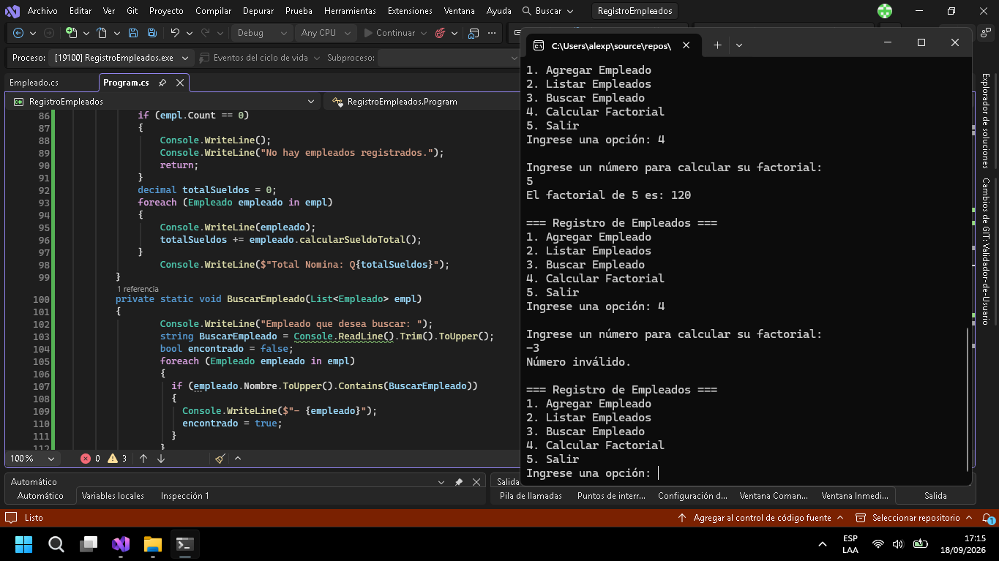
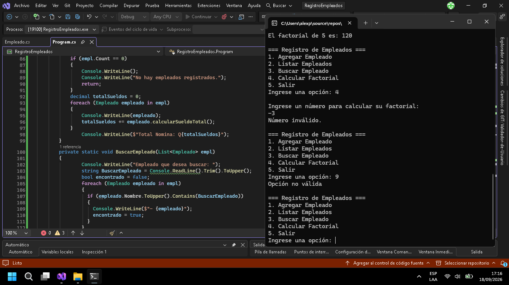
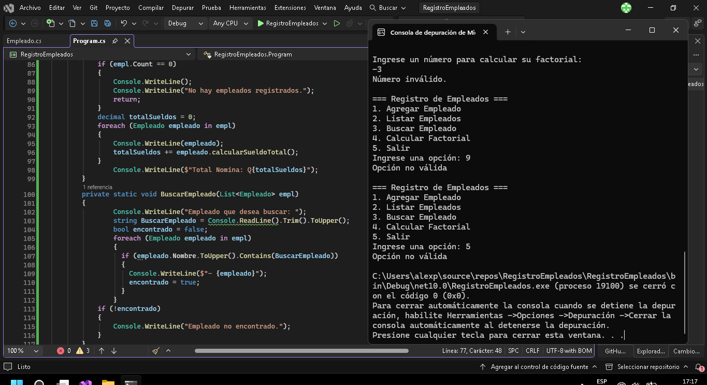

# Nombre del proyecto ||| Registro de Empleados
## Pasos para ejecutar el proyecto
- | abrir visual studio community 2026
- | presionar "F5" para ejecutar el proyecto
- | Ingresar los datos correspondientes 

# Capturas

